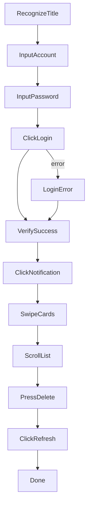

```mermaid
flowchart TD
    RecognizeTitle["RecognizeTitle"]
    InputAccount["InputAccount"]
    InputPassword["InputPassword"]
    ClickLogin["ClickLogin"]
    LoginError["LoginError"]
    VerifySuccess["VerifySuccess"]
    ClickNotification["ClickNotification"]
    SwipeCards["SwipeCards"]
    ScrollList["ScrollList"]
    PressDelete["PressDelete"]
    ClickRefresh["ClickRefresh"]
    Done["Done"]

    RecognizeTitle --> InputAccount
    InputAccount --> InputPassword
    InputPassword --> ClickLogin
    ClickLogin --> VerifySuccess
    ClickLogin -->|error| LoginError
    LoginError --> VerifySuccess
    VerifySuccess --> ClickNotification
    ClickNotification --> SwipeCards
    SwipeCards --> ScrollList
    ScrollList --> PressDelete
    PressDelete --> ClickRefresh
    ClickRefresh --> Done
```
