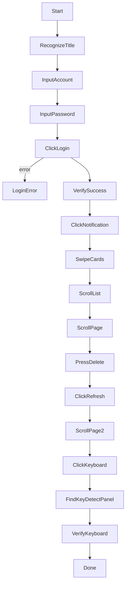

```mermaid

flowchart TD
    Start["Start"]
    RecognizeTitle["RecognizeTitle"]
    InputAccount["InputAccount"]
    InputPassword["InputPassword"]
    ClickLogin["ClickLogin"]
    LoginError["LoginError"]
    VerifySuccess["VerifySuccess"]
    ClickNotification["ClickNotification"]
    SwipeCards["SwipeCards"]
    ScrollList["ScrollList"]
    ScrollPage["ScrollPage"]
    PressDelete["PressDelete"]
    ClickRefresh["ClickRefresh"]
    ScrollPage2["ScrollPage2"]
    ClickKeyboard["ClickKeyboard"]
    FindKeyDetectPanel["FindKeyDetectPanel"]
    VerifyKeyboard["VerifyKeyboard"]
    Done["Done"]

    Start --> RecognizeTitle
    RecognizeTitle --> InputAccount
    InputAccount --> InputPassword
    InputPassword --> ClickLogin
    ClickLogin --> VerifySuccess
    ClickLogin -->|error| LoginError
    VerifySuccess --> ClickNotification
    ClickNotification --> SwipeCards
    SwipeCards --> ScrollList
    ScrollList --> ScrollPage
    ScrollPage --> PressDelete
    PressDelete --> ClickRefresh
    ClickRefresh --> ScrollPage2
    ScrollPage2 --> ClickKeyboard
    ClickKeyboard --> FindKeyDetectPanel
    FindKeyDetectPanel --> VerifyKeyboard
    VerifyKeyboard --> Done
```
